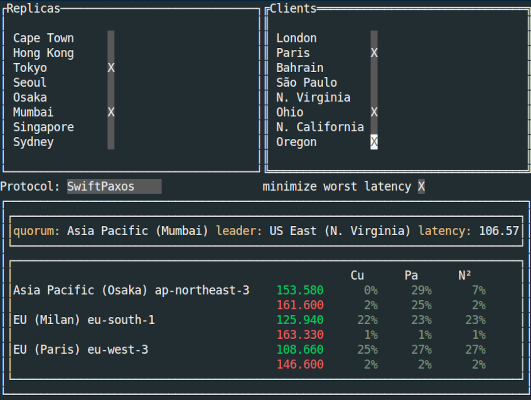

# Flint

Flint computes expected latencies for the selected set of AWS clients using different replication protocols.



Flint imports latency table from [cloudping](https://www.cloudping.co/grid/p_90/timeframe/1D)
with the 90th percentile and a single day timeframe. One can change a link in .

## Installation

```bash
go install github.com/vonaka/flint@latest
```

## Navigation

- __Tab__: switch the focus
- __p__: toggle the protocol
- __q__: quit